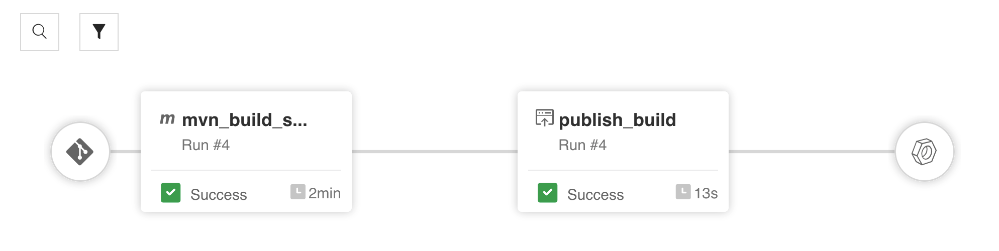

# JFrog Pipelines - Maven HelloWorld sample

This is a sample of a simple HelloWorld Java application that is built with Maven by a JFrog pipeline.

This example was built upon the [jfrog-pipelines-maven-sample](https://github.com/jfrog/jfrog-pipelines-maven-sample) and (artifactory-maven-plugin-example)[https://github.com/jfrog/project-examples/tree/master/artifactory-maven-plugin-example] samples.

For detailed instructions on how to setup a JFrog pipeline, as well as explanation of its configuration, refer to the [JFrog Pipelines Step-by-Step](https://www.jfrog.com/confluence/display/JFROG/Pipelines+Step-By-Step) or to the [Pipelines Example: Build a Maven project](https://www.jfrog.com/confluence/display/JFROG/Pipelines+Example%3A+Maven+Build) documentation pages.

---

### Summarized setup instructions

1. Fork this project

2. Have your [maven repositories](https://www.jfrog.com/confluence/display/JFROG/QuickStart+Guide%3A+Maven+and+Gradle) created in your artifactory server

3. Add [integrations](https://www.jfrog.com/confluence/display/JFROG/Pipelines+Step-By-Step#PipelinesStep-By-Step-AddIntegrations) for both your artifactory server and your git account to connect to the repository created in the step (1)

4. Updtate `values.yml` with your own values, see inline comments in the file for guidance

5. Add your git repo from (1) as a [pipeline source](https://www.jfrog.com/confluence/display/JFROG/Pipelines+Step-By-Step#PipelinesStep-By-Step-add-pipeline-sourceAddaPipelineSource)

6. Once the new pipeline source is successfully resolved, go to "Pipelines > My Pipelines" in Artifactory and click on your pipeline's name, which is ready to be executed.

---

